# Workflow Diagrams

> Visual decision maps for key mediation workflows. These can be rendered with any Mermaid-compatible tool.

---

## 1. Intake & Screening Flow

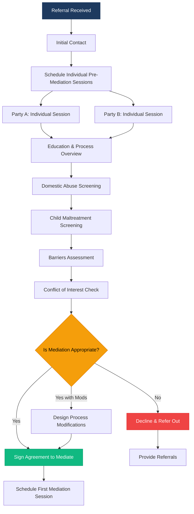

---

## 2. Domestic Abuse Screening Decision Tree

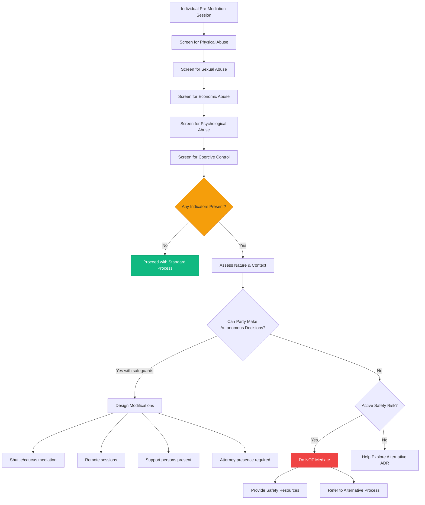

---

## 3. Child Maltreatment Response Protocol

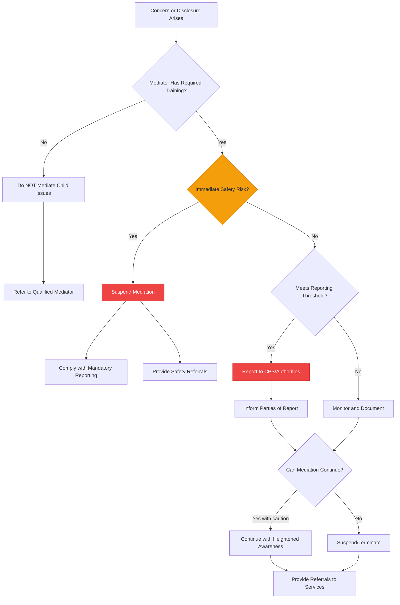

---

## 4. Conflict of Interest Decision Flow

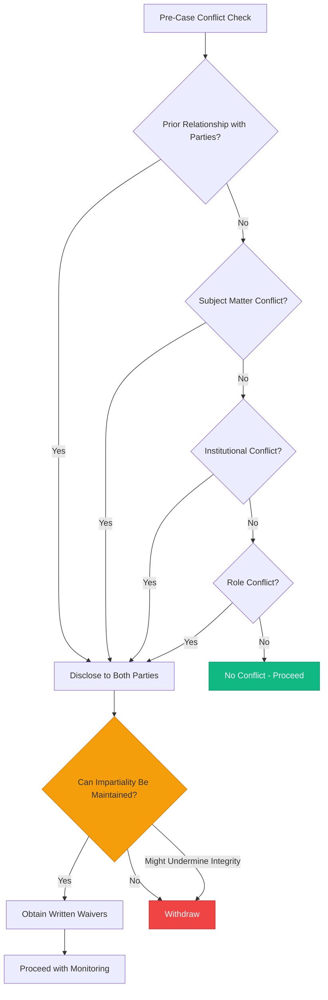

---

## 5. Suspension & Termination Decision

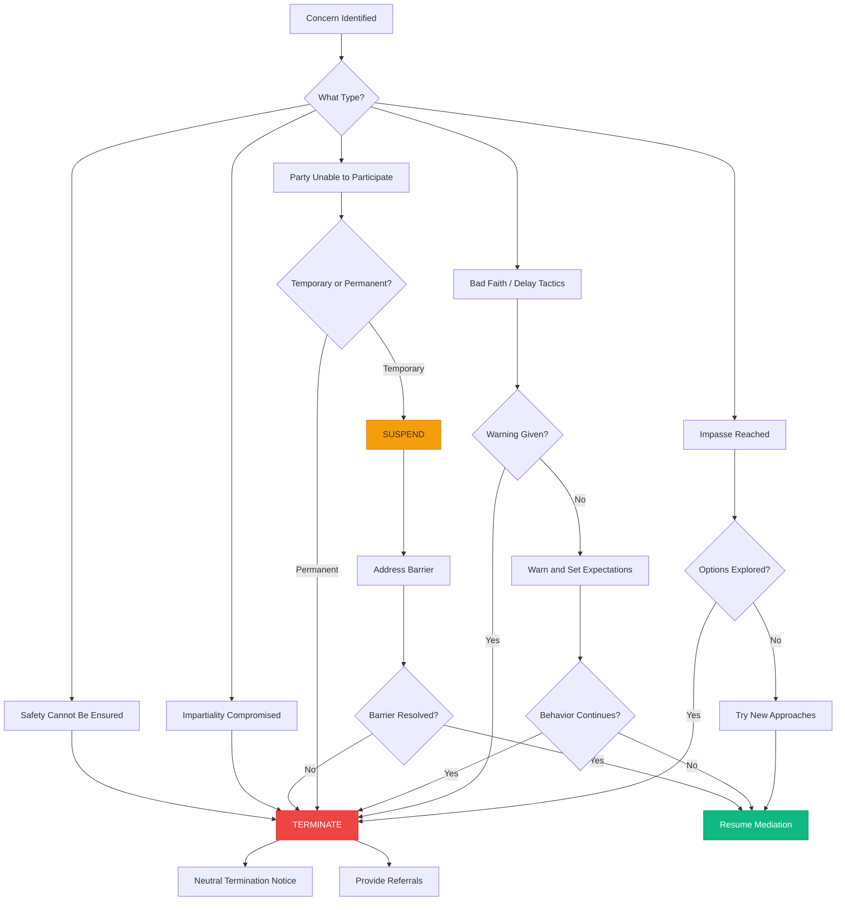

---

## 6. Full Mediation Process Overview

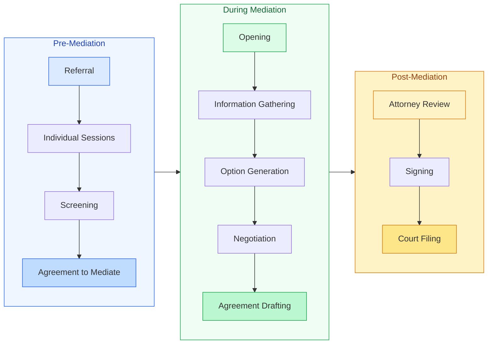

---

## 7. Party Preparation Workflow

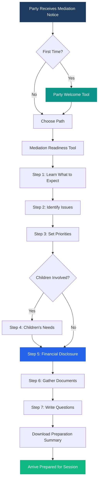

---

## 8. Mediator Case Lifecycle

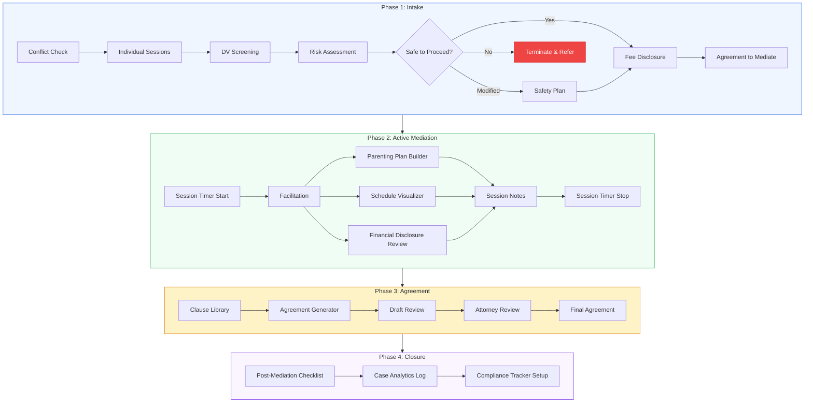

---

## 9. Risk Assessment Scoring Flow

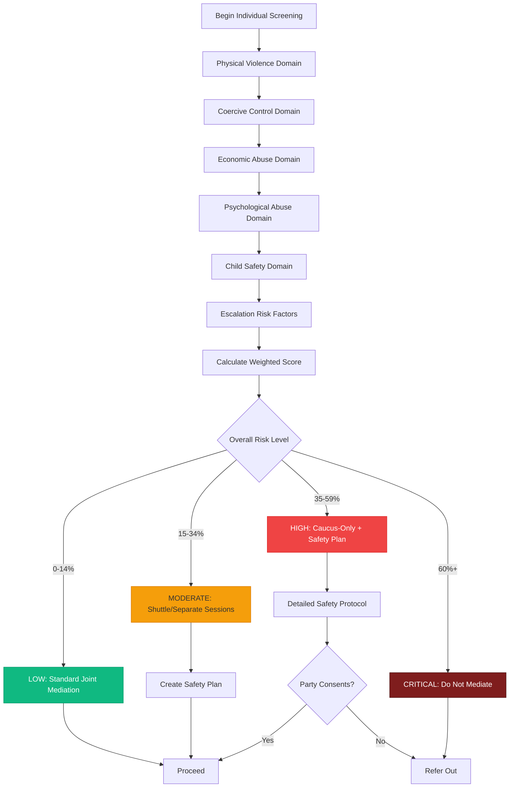

---

## 10. Agreement Generation Flow

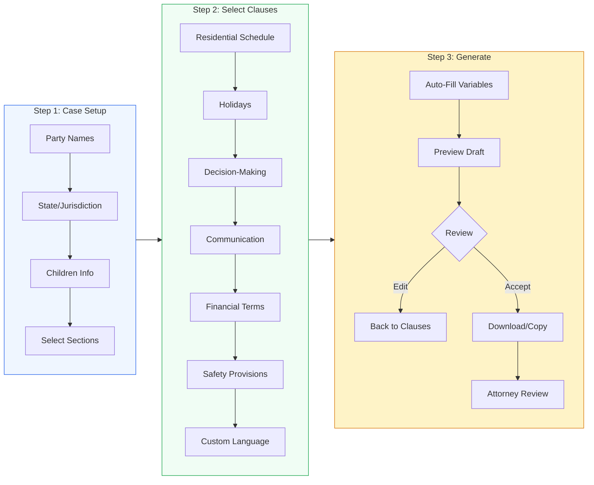

---

## 11. Ethical Decision Engine Flow

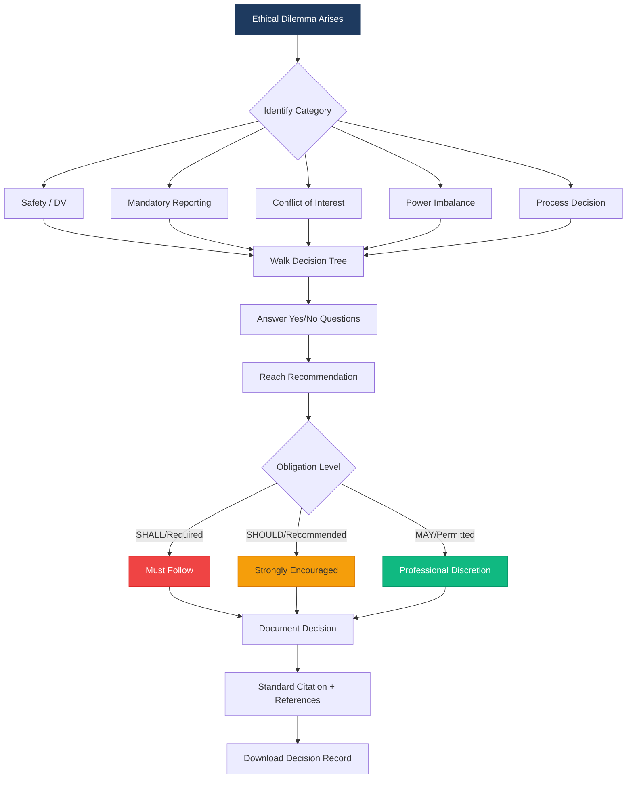

---

## 12. Conflict Check Process

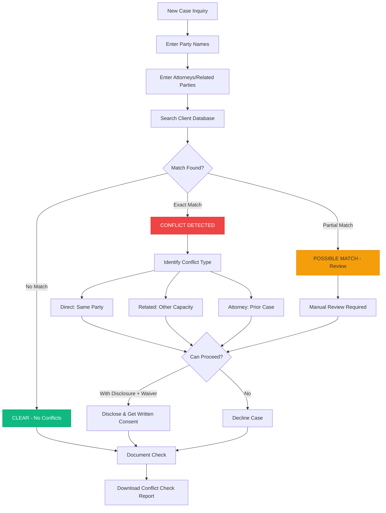

---

## 13. Child Support Calculation Flow

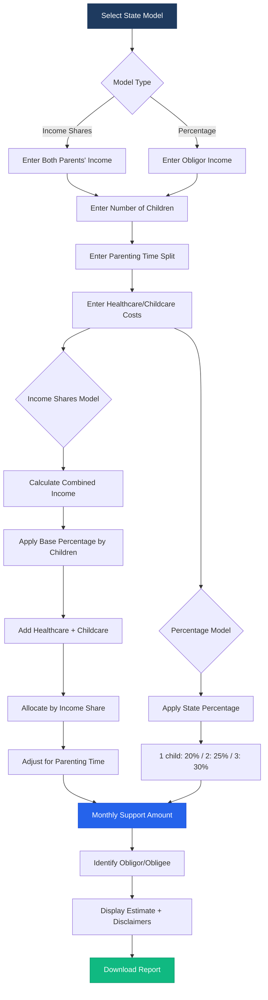

---

## 14. Training Simulator Flow

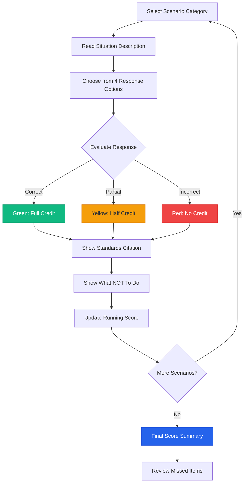

---

## 15. Practice Analytics Flow

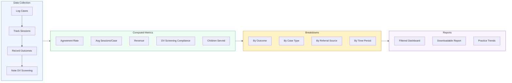

---

## 16. Complete Tool Ecosystem

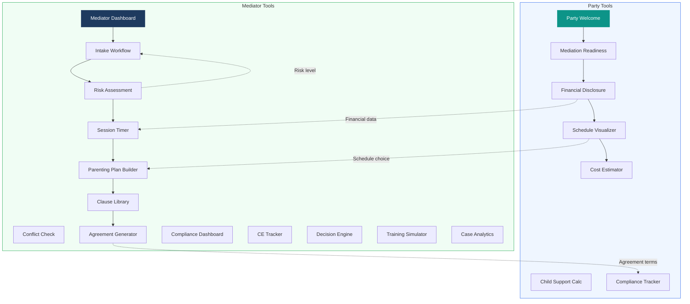

---

## 17. AI Use Assessment Workflow (NCTDR/ICODR ODR Standards)

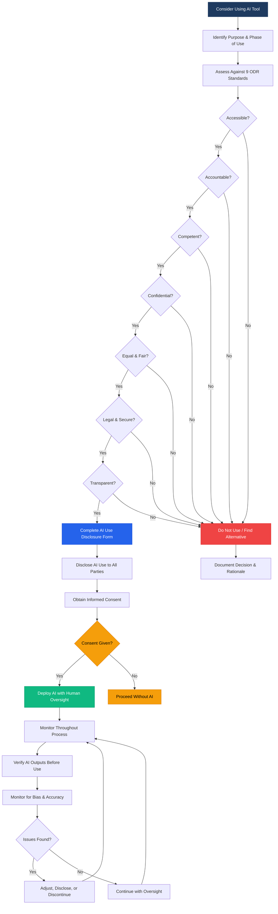
