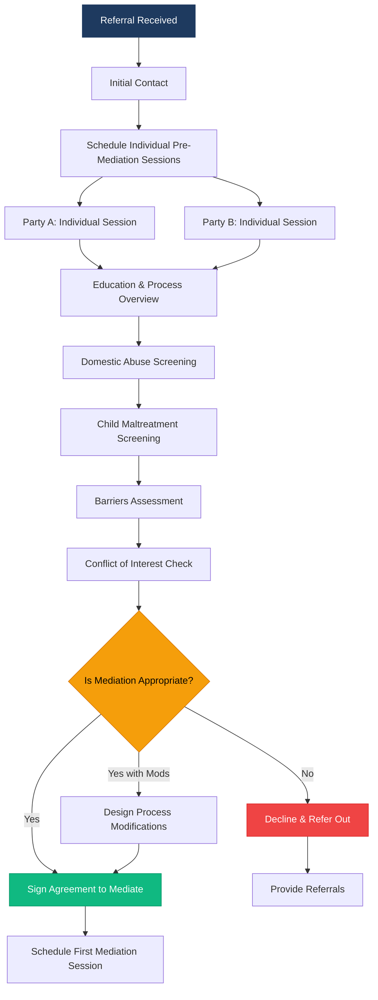
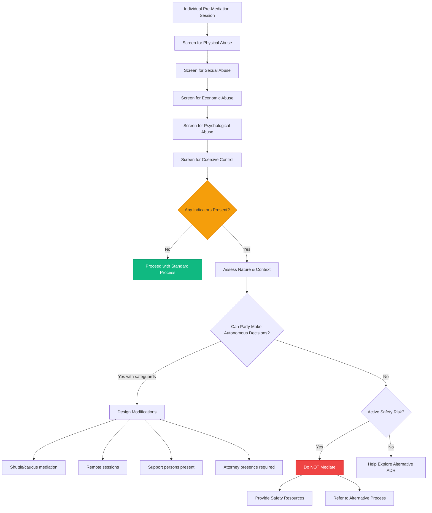
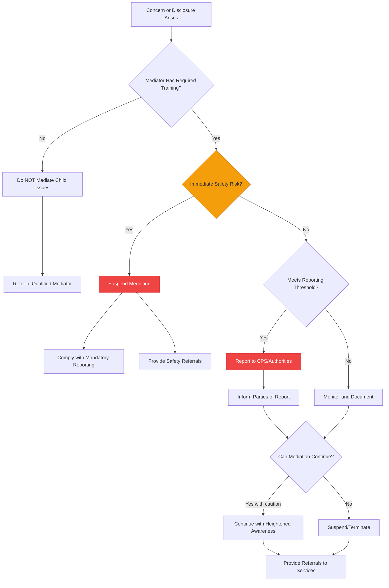
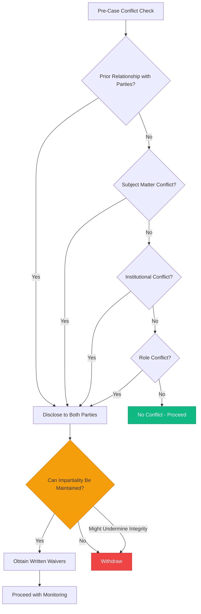
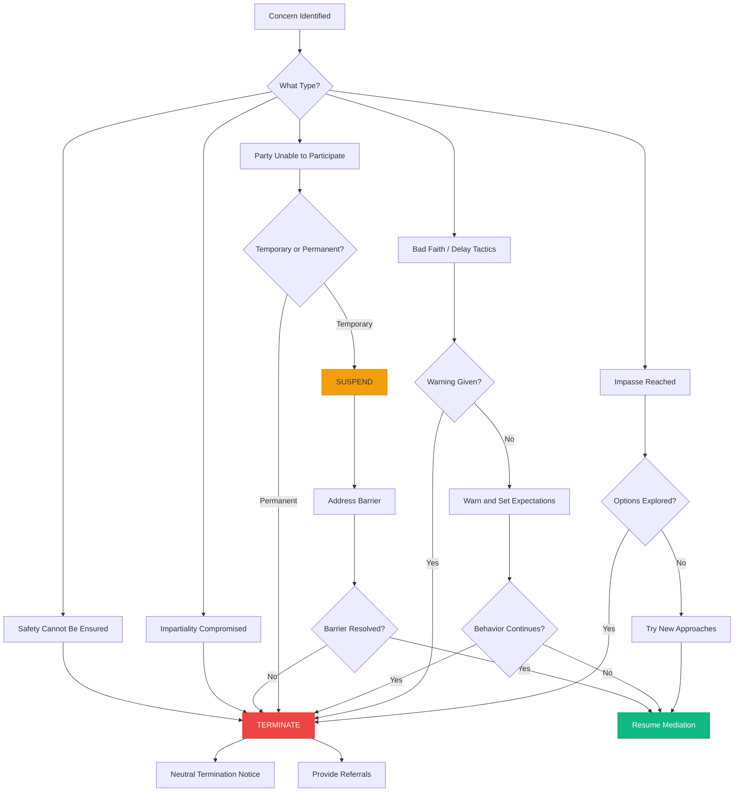
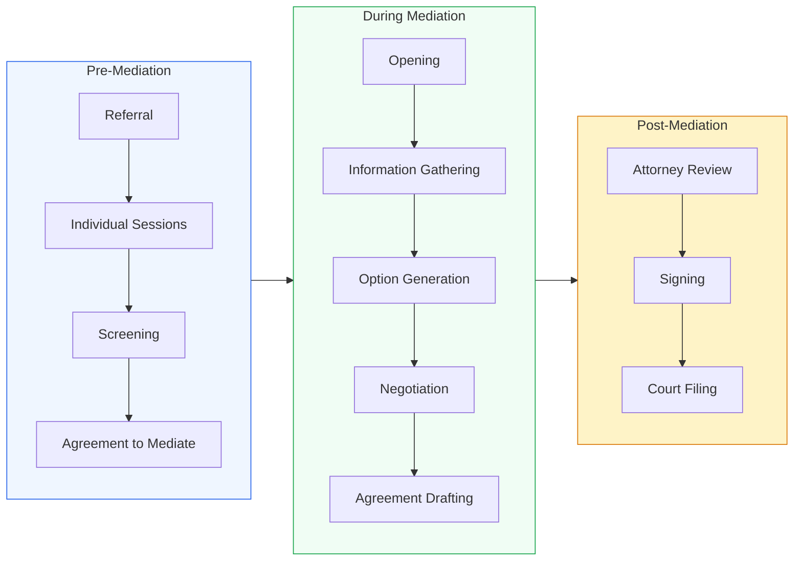

# Workflow Diagrams

> Visual decision maps for key mediation workflows. These can be rendered with any Mermaid-compatible tool.

---

## 1. Intake & Screening Flow

---

## 2. Domestic Abuse Screening Decision Tree

---

## 3. Child Maltreatment Response Protocol

---

## 4. Conflict of Interest Decision Flow

---

## 5. Suspension & Termination Decision

---

## 6. Full Mediation Process Overview

